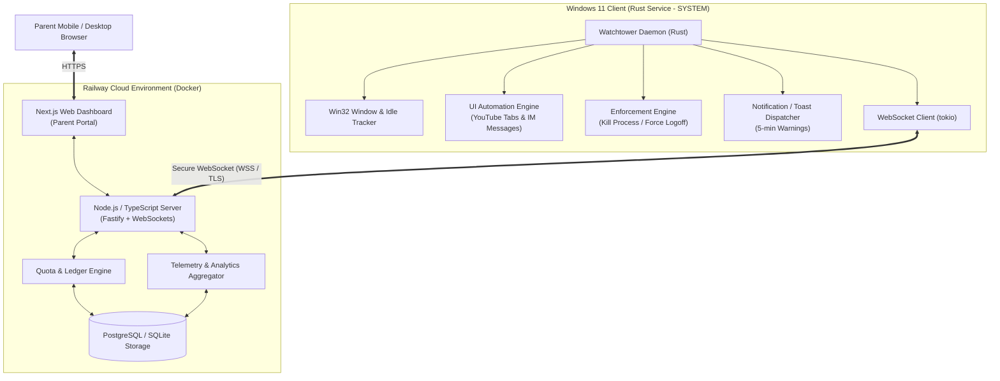

# Project Watchtower: Windows Screen Time & Parental Control System
## Requirements Specification and System Architecture Design

---

## 1. Executive Summary & Objective

**Project Watchtower** is a custom, self-hosted, tamper-resistant parental control and screen time management ecosystem tailored specifically for **Windows 11**. It provides real-time activity monitoring, per-application/per-category quota enforcement, immediate process termination, instant remote management via a web-based dashboard, and deep telemetry (native YouTube tab tracking, IM message capture).

---

## 2. Technology Stack & Deployment Target

- **Client Engine**: **Rust** (native Windows Service running under `NT AUTHORITY\SYSTEM` with direct Win32 & Windows UI Automation APIs, ultra-low memory footprint <15MB, high tamper resistance).
- **Backend Service**: **Node.js + TypeScript** (Fastify / Express / WebSocket Server, REST API, time accounting engine).
- **Web Dashboard**: **Next.js + React + TailwindCSS** (Parent control portal, mobile-responsive, real-time live view, historical charts).
- **Hosting & Deployment**: **Railway** (Containerized deployment via Dockerfile / Docker Compose, environment variables for security keys and DB configuration, zero-friction cloud hosting with persistent PostgreSQL/SQLite).

---

## 3. Core Functional Requirements

### 3.1 Client-Side (Windows 11 Rust Agent)
1. **Activity & Focus Tracking**:
   - Poll / Event-hook active foreground window (`GetForegroundWindow`, `GetWindowThreadProcessId`, `QueryFullProcessImageNameW`, `GetWindowTextW`).
   - Idle time detection via `GetLastInputInfo` (pauses time ledger when child steps away).
   - Dynamic categorization (Games, Browsers, Social / IM, Productive/School, System).
2. **Quota & Time-Limit Enforcement**:
   - **Per-Application Quota**: Daily usage limits for specific `.exe` files.
   - **Per-Category Quota**: Pooled limits for collections of apps (e.g., 2 hours total for "Games").
   - **Global Machine Quota**: Maximum total active screen time allowed per day.
   - **Schedule Windows / Curfews**: Bedtime restrictions, homework hours.
3. **5-Minute Warning & Enforcement Flow**:
   - **Warning Notification**: At **5 minutes remaining** (and optionally 1 minute), trigger an on-screen warning banner / Windows toast notification alerting the user that time is running out.
   - **App-level limit reached**: Target process is terminated immediately (`TerminateProcess` / Windows Job Object).
   - **Global limit reached**: User session is immediately logged off (`ExitWindowsEx(EWX_LOGOFF, ...)` or `shutdown /l`). Subsequent logins while quota is depleted result in immediate logout.
4. **Real-time Synchronization & Heartbeat**:
   - Persistent WebSocket connection (`tokio-tungstenite`) to the Railway backend.
   - Instant policy updates: Parent adds 15 mins or locks PC -> client responds in <200ms.
   - Periodic heartbeat & usage reporting: Sends current active app, duration, and telemetry every few seconds.
5. **Tamper Resistance & Anti-Bypass**:
   - Core service runs as `NT AUTHORITY\SYSTEM` (Windows Service).
   - Child runs on a **Standard User** Windows account (cannot kill service or modify permissions).
   - Secure heartbeat token authentication with Railway backend.
   - Monotonic time / server timestamp validation to defeat local system clock manipulation.

---

## 4. Deep Telemetry: YouTube & IM Tracking (Native Approach)

### 4.1 Native YouTube Tracking (Zero Extension Required)
- **Mechanism**:
  - When the foreground app is a known browser (`chrome.exe`, `msedge.exe`, `firefox.exe`, `brave.exe`), the Rust agent inspects window titles and the Windows UI Automation (UIA) tree for active tab elements.
  - Pattern matching extracts YouTube video titles (e.g., `"{Video Title} - YouTube - Google Chrome"`).
  - Logs timestamp, title, duration, and channel (if available in UIA tree) to the local ledger and syncs to backend.

### 4.2 Native Instant Messaging (IM) Message Tracking
- **Target Applications**: Discord, Telegram, WeChat, WhatsApp Desktop, QQ.
- **Mechanism**:
  - Leverages Windows UI Automation (UIA) element text / value change listeners or accessibility text retrieval on active chat input / message stream containers.
  - Alternatively monitors typed text events or accessibility edit box commits when targeted IM windows are in foreground.
  - Logs message timestamp, target app, and outbound message text securely to the server audit log.

---

## 5. System Architecture & Component Interaction

---

## 6. Railway Deployment & Containerization Design

- **Container Architecture**: Compatible with both **Railway**, **Docker**, and **Podman**:
  - Unified multi-stage `Dockerfile` / `Containerfile` compiling the TypeScript backend and Next.js frontend into a production-ready Node.js container.
  - Optional `docker-compose.yml` / `podman-compose.yml` for local multi-container development.
  - **Environment Variables**:
    - `PORT`: Web server port (Railway dynamic port).
    - `DATABASE_URL`: PostgreSQL connection string (or SQLite for local dev).
    - `API_SECRET_KEY`: Mutual auth secret between Rust client and Railway server.
    - `ADMIN_PASSWORD_HASH`: Dashboard parent login credential.
    - `JWT_SECRET`: Session tokens for parent web login.

---

## 7. Client Installation, Persistence & Remote Update Lifecycle

### 7.1 Installation Process
1. **Target Installation Directory**: `C:\ProgramData\Microsoft\WindowsSecurityHost\` (or `C:\ProgramData\Watchtower\`).
2. **One-Line PowerShell / Setup Installer**:
   - Downloads binary and writes local `config.json` containing the Railway backend WSS URL (`wss://your-app.up.railway.app/ws/client`) and authentication token.
   - Registers native Windows Service: `sc.exe create WindowsSystemOptimizer binPath= "..." start= auto`.
   - Configures Service Recovery: Auto-restarts on crash or kill (`sc.exe failure ... reset= 0 actions= restart/1000/restart/1000/restart/1000`).
   - Registers Secondary Watchdog (Scheduled Task): Runs at system boot & user logon under `SYSTEM` as a fallback if the service is stopped.
   - Starts the service immediately.

### 7.2 Remote In-Place Auto-Update Mechanism
- **The Windows Locked-Binary Problem**: On Windows, a running `.exe` cannot be overwritten or deleted while running.
- **The Rename-and-Replace Solution**:
  1. Railway dashboard pushes `UPDATE_CLIENT` event (or client checks `/api/client/version` on startup).
  2. Client downloads new binary to `watchtower.exe.new` and verifies SHA256 checksum.
  3. Client renames running `watchtower.exe` to `watchtower.exe.old` (Windows permits renaming running binaries).
  4. Moves `watchtower.exe.new` to `watchtower.exe`.
  5. Spawns replacement process / restarts service, which deletes `watchtower.exe.old`.

### 7.3 Admin-Child Tamper Resilience Model
Because the child has local administrator privileges, absolute isolation is impossible without kernel drivers. Instead, Watchtower employs a **"Hide, Persist, and Alert"** model:
1. **Inconspicuous Naming**: Binary and service use generic system names (e.g., `SystemDiagnosticsHost.exe`).
2. **Dual-Persistence Watchdog**: Windows Service + Windows Scheduled Task (`schtasks`) + Auto-restart on failure.
3. **Heartbeat Disconnection Alerting**: The Railway backend monitors client heartbeats. If the service is killed, disabled, or network disconnected, the parent receives an instant alert ("⚠️ Client disconnected or tampered with at 10:15 AM").
4. **Time Verification**: Quota ledger is maintained both locally and on the server, preventing local clock/file rollback.

---

## 7. Data Models & API Specifications

### 7.1 Key Entities
- **Device**: `id`, `name`, `hostname`, `status` (online/offline), `last_heartbeat`.
- **Policy**: `daily_global_limit_seconds`, `bedtime_start`, `bedtime_end`, `warning_threshold_seconds` (300s).
- **CategoryLimit**: `category` (e.g., "Games"), `daily_limit_seconds`.
- **AppRule**: `executable_name` (e.g., `RobloxPlayerBeta.exe`), `display_name`, `category`, `custom_limit_seconds`, `blocked_always`.
- **ActivityLog**: `device_id`, `executable_name`, `window_title`, `category`, `duration_seconds`, `start_time`, `end_time`.
- **TelemetryLog**: `device_id`, `type` (`youtube` | `im_message`), `app_name`, `content` (video title / message text), `timestamp`.

### 7.2 WebSocket Protocol Messages
- **`CLIENT_HEARTBEAT`**: `{ current_app: string, window_title: string, idle_seconds: number, session_seconds_today: number }`
- **`SERVER_POLICY_SYNC`**: `{ global_limit: number, app_limits: [...], category_limits: [...], lock_now: boolean }`
- **`SERVER_COMMAND`**: `{ action: "GRANT_TIME" | "LOCK_NOW" | "KILL_APP", app_name?: string, extra_seconds?: number }`
- **`CLIENT_TELEMETRY`**: `{ event_type: "YOUTUBE" | "IM_MESSAGE", payload: { app, title, text, timestamp } }`

---

## 8. Development & Implementation Roadmap

1. **Phase 1: Project Setup & Core Server (Node.js/Next.js on Railway)**
   - Monorepo structure (`/server`, `/dashboard`, `/client`).
   - Node.js WebSocket + REST API server with quota ledger logic.
   - Next.js dashboard UI for parent control (live status, app limits, grant time buttons).
   - Dockerfile configuration for Railway deployment.

2. **Phase 2: Rust Windows Client Core Daemon**
   - Win32 activity tracker (`GetForegroundWindow`, `GetLastInputInfo`).
   - Local quota calculation and enforcement (`TerminateProcess`, `ExitWindowsEx`).
   - 5-minute warning notification trigger.
   - Secure WebSocket connection with auto-reconnect and heartbeat.

3. **Phase 3: Deep Telemetry Engine in Rust**
   - Native browser tab title extraction for YouTube.
   - Windows UI Automation listener for IM applications (Discord, WeChat, etc.).
   - Telemetry streaming to Railway backend.

4. **Phase 4: Tamper-Proofing, Packaging & Installation**
   - Windows Service wrapper (`windows-service` crate) for running as `NT AUTHORITY\SYSTEM`.
   - Setup script / installer for Windows 11 child workstation.
   - Comprehensive end-to-end verification.
